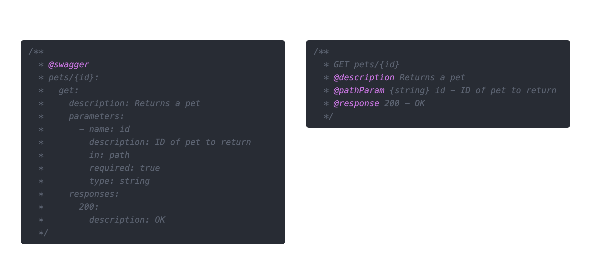

<div align="center">
  <h3>Visulima jsdoc-open-api</h3>
  <p>

  Visulima jsdoc-open-api parser and generator is a forked version of [openapi-comment-parser](https://github.com/bee-travels/openapi-comment-parser) and [swagger-jsdoc](https://github.com/Surnet/swagger-jsdoc) its built on top of [swagger](https://swagger.io/) and [JSDoc](https://jsdoc.app/), for speed and minimal runtime overhead.

  </p>
</div>

<br />

<div align="center">

[![typescript-image]][typescript-url] [![npm-image]][npm-url] [![license-image]][license-url] [![synk-image]][synk-url]

</div>

<div align="center">
  <sub>Built with ❤︎ by <a href="https://twitter.com/_prisis_">Daniel Bannert</a></sub>
</div>

## Installation

```sh
npm install @visulima/jsdoc-open-api
```

```sh
yarn add @visulima/jsdoc-open-api
```

```sh
pnpm add @visulima/jsdoc-open-api
```

## Usage

Choose the syntax you want to use for your OpenAPI definitions:



CLI:

```bash
# This generate the .openapirc.js config file, this command is only needed on the first run
jsdoc-open-api init

# This will generate the swagger.json file
jsdoc-open-api generate src/
```

## OpenApi yaml syntax

The library will take the contents of @openapi (or @swagger):

```ts
/**
 * @openapi
 * /:
 *   get:
 *     description: Welcome to swagger-jsdoc!
 *     responses:
 *       200:
 *         description: Returns a mysterious string.
 */

```

## OpenApi short syntax

### Basic structure
You can write OpenAPI definitions in JSDoc comments or YAML files.
In this guide, we use only JSDoc comments examples. However, YAML files work equally as well.

Each comment defines individual endpoints (paths) in your API, and the HTTP methods (operations) supported by these endpoints.
For example, `GET /users` can be described as:

```js
/**
 * GET /users
 * @summary Returns a list of users.
 * @description Optional extended description in CommonMark or HTML.
 * @response 200 - A JSON array of user names
 * @responseContent {string[]} 200.application/json
 */
```

#### Parameters
Operations can have parameters passed via URL path (`/users/{userId}`), query string (`/users?role=admin`),
headers (`X-CustomHeader: Value`) or cookies (`Cookie: debug=0`).
You can define the parameter data types, format, whether they are required or optional, and other details:

```js
/**
 * GET /users/{userId}
 * @summary Returns a user by ID.
 * @pathParam {int64} userId - Parameter description in CommonMark or HTML.
 * @response 200 - OK
 */
```

For more information, see [Describing Parameters](/docs/short/describing-parameters.md).

#### Request body
If an operation sends a request body, use the `bodyContent` keyword to describe the body content and media type.
Use `bodyRequired` to indicate that a request body is required.

```js
/**
 * POST /users
 * @summary Creates a user.
 * @bodyContent {User} application/json
 * @bodyRequired
 * @response 201 - Created
 */
```

For more information, see [Describing Request Body](/docs/short/describing-request-body.md).

#### Responses
For each operation, you can define possible status codes, such as 200 OK or 404 Not Found, and the response body content.
You can also provide example responses for different content types:

```js
/**
 * GET /users/{userId}
 * @summary Returns a user by ID.
 * @pathParam {int64} userId - The ID of the user to return.
 * @response 200 - A user object.
 * @responseContent {User} 200.application/json
 * @response 400 - The specified user ID is invalid (not a number).
 * @response 404 - A user with the specified ID was not found.
 * @response default - Unexpected error
 */
```

For more information, see [Describing Responses](/docs/short/describing-responses.md).

#### Input and output models
You can create global `components/schemas` section lets you define common data structures used in your API.
They can be referenced by name whenever a schema is required – in parameters, request bodies, and response bodies.
For example, this JSON object:

```json
{
  "id": 4,
  "name": "Arthur Dent"
}
```

can be represented as:

```yaml
components:
  schemas:
    User:
      properties:
        id:
          type: integer
        name:
          type: string
      # Both properties are required
      required:
        - id
        - name
```

and then referenced in the request body schema and response body schema as follows:

```js
/**
 * GET /users/{userId}
 * @summary Returns a user by ID.
 * @pathParam {integer} userId
 * @response 200 - OK
 * @responseContent {User} 200.application/json
 */

/**
 * POST /users
 * @summary Creates a new user.
 * @bodyContent {User} application/json
 * @bodyRequired
 * @response 201 - Created
 */
```

#### Authentication
The `securitySchemes` and `security` keywords are used to describe the authentication methods used in your API.
```yaml
components:
  securitySchemes:
    BasicAuth:
      type: http
      scheme: basic
```

```js
/**
 * GET /users
 * @security BasicAuth
 */
```

Supported authentication methods are:
- HTTP authentication: Basic, Bearer, and so on.
- API key as a header or query parameter or in cookies
- OAuth 2
- OpenID Connect Discovery

For more information, see [Authentication](/docs/short/authentication.md).

[typescript-image]: https://img.shields.io/badge/Typescript-294E80.svg?style=for-the-badge&logo=typescript
[typescript-url]: "typescript"
[license-image]: https://img.shields.io/npm/l/@visulima/jsdoc-open-api?color=blueviolet&style=for-the-badge
[license-url]: LICENSE.md "license"
[npm-image]: https://img.shields.io/npm/v/@visulima/jsdoc-open-api/alpha.svg?style=for-the-badge&logo=npm
[npm-url]: https://www.npmjs.com/package/@visulima/jsdoc-open-api/v/alpha "npm"
[synk-image]: https://img.shields.io/snyk/vulnerabilities/github/visulima/jsdoc-open-api?label=Synk%20Vulnerabilities&style=for-the-badge
[synk-url]: https://snyk.io/test/github/visulima/jsdoc-open-api?targetFile=package.json "synk"
