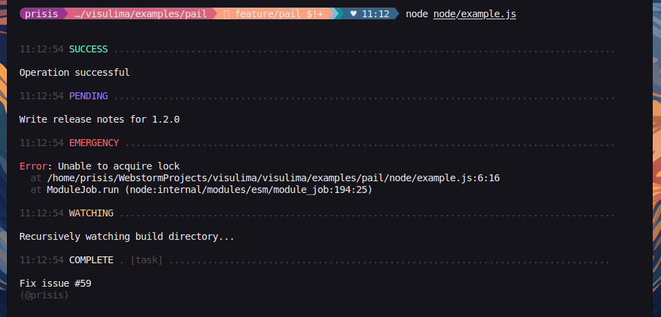
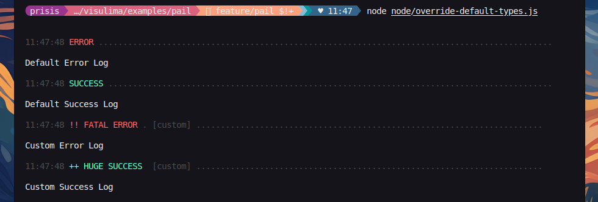
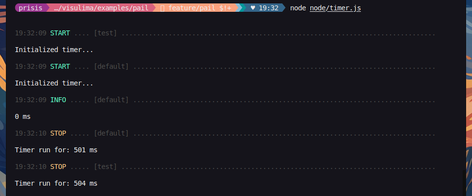

<div align="center">
  <h3>Visulima Pail</h3>
  <p>
  Highly configurable Logger for Node.js and Browser, built on top of

[@visulima/fmt][fmt],
[@visulima/colorize](https://github.com/visulima/visulima/tree/main/packages/colorize),
[ansi-escapes](https://www.npmjs.com/package/ansi-escapes),
[safe-stable-stringify](https://www.npmjs.com/package/safe-stable-stringify),
[string-length](https://www.npmjs.com/package/string-length),
[terminal-size](https://www.npmjs.com/package/terminal-size) and
[wrap-ansi](https://www.npmjs.com/package/wrap-ansi)

  </p>
</div>

<br />

<div align="center">

<div style="display: flex;">


</div>

[![typescript-image]][typescript-url] [![npm-image]][npm-url] [![license-image]][license-url]

</div>

---

<div align="center">
    <p>
        <sup>
            Daniel Bannert's open source work is supported by the community on <a href="https://github.com/sponsors/prisis">GitHub Sponsors</a>
        </sup>
    </p>
</div>

---

## Why Pail?

-   Easy to use
-   Hackable to the core
-   Integrated timers
-   Custom pluggable processors and reporters
-   TypeScript support
-   Interactive and regular modes
-   Secrets & sensitive information filtering (soon)
-   Filename, date and timestamp support
-   Scoped loggers and timers
-   Scaled logging levels mechanism
-   String interpolation support
-   Object and error interpolation
-   Stack trace and pretty errors
-   Simple and minimal syntax
-   Spam prevention by throttling logs
-   Browser support
-   Redirect console and stdout/stderr to pail and easily restore redirect.
-   `Pretty` or `JSON` output
-   CJS & ESM with tree shaking support
-   Supports circular structures
-   Fast and powerful, see the [benchmarks](__bench__/README.md)

## Install

```sh
npm install @visulima/pail
```

```sh
yarn add @visulima/pail
```

```sh
pnpm add @visulima/pail
```

## Concepts

> Most importantly, `pail` adheres to the log levels defined in [RFC 5424][rfc-5424] extended with `trace` level.
> This means that you can use the log levels to filter out messages that are not important to you.

### Log Levels

Pail supports the logging levels described by [RFC 5424][rfc-5424].

-   `DEBUG`: Detailed debug information.

-   `INFO`: Interesting events. Examples: User logs in, SQL logs.

-   `NOTICE`: Normal but significant events.
-
-   `TRACE`: Very detailed and fine-grained informational events.

-   `WARNING`: Exceptional occurrences that are not errors. Examples: Use of deprecated APIs, poor use of an API, undesirable things that are not necessarily wrong.

-   `ERROR`: Runtime errors that do not require immediate action but should typically be logged and monitored.

-   `CRITICAL`: Critical conditions. Example: Application component unavailable, unexpected exception.

-   `ALERT`: Action must be taken immediately. Example: Entire website down, database unavailable, etc. This should trigger the SMS alerts and wake you up.

-   `EMERGENCY`: Emergency: system is unusable.

### Reporters

Reporters are responsible for writing the log messages to the console or a file. `pail` comes with a few built-in reporters:

| Browser (console.{function}) | Server (stdout or stderr) |
| ---------------------------- | ------------------------- |
| `JsonReporter`               | `JsonReporter`            |
| `PrettyReporter`             | `PrettyReporter`          |
| x                            | `FileReporter`            |

### Processors

Processors are responsible for processing the log message (Meta Object) before it's written to the console or a file.
This usually means that they add some metadata to the record's `context` property.

A processor can be added to a logger directly (and is subsequently applied to log records before they reach any handler).

`pail` comes with a few built-in processors:

-   `CallerProcessor` - adds the caller information to the log message
    -   The Meta Object is extended with a file name, line number and column number
-   `RedactProcessor` - redacts sensitive information from the log message (Soon)
-   `MessageFormatterProcessor` - formats the log message (Util.format-like unescaped string formatting utility) [@visulima/fmt][fmt]
-   `ErrorProcessor` - serializes the error with cause object to a std error object that can be serialized.

## Usage

```typescript
import { pail } from "@visulima/pail";

pail.success("Operation successful");
pail.debug("Hello", "from", "L59");
pail.pending("Write release notes for %s", "1.2.0");
pail.fatal(new Error("Unable to acquire lock"));
pail.watch("Recursively watching build directory...");
pail.complete({
    prefix: "[task]",
    message: "Fix issue #59",
    suffix: "(@klauscfhq)",
});
```



### Custom Loggers

To create a custom logger define an `options` object yielding a types field with the logger data and pass it as argument to the createPail function.

```typescript
import { createPail } from "@visulima/pail";

const custom = createPail({
    types: {
        remind: {
            badge: "**",
            color: "yellow",
            label: "reminder",
            logLevel: "info",
        },
        santa: {
            badge: "🎅",
            color: "red",
            label: "santa",
            logLevel: "info",
        },
    },
});

custom.remind("Improve documentation.");
custom.santa("Hoho! You have an unused variable on L45.");
```


Here is an example where we override the default `error` and `success` loggers.

```typescript
import { pail, createPail } from "@visulima/pail";

pail.error("Default Error Log");
pail.success("Default Success Log");

const custom = createPail({
    scope: "custom",
    types: {
        error: {
            badge: "!!",
            label: "fatal error",
        },
        success: {
            badge: "++",
            label: "huge success",
        },
    },
});

custom.error("Custom Error Log");
custom.success("Custom Success Log");
```



## Scoped Loggers

To create a scoped logger from scratch, define the `scope` field inside the options object and pass it as argument to the createPail function.

```typescript
import { createPail } from "@visulima/pail";

const mayAppLogger = createPail({
    scope: "my-app",
});

mayAppLogger.info("Hello from my app");
```


To create a scoped logger based on an already existing one, use the `scope()` function, which will return a new pail instance, inheriting all custom loggers, timers, secrets, streams, configuration, log level, interactive mode & disabled statuses from the initial one.

```typescript
import { pail } from "@visulima/pail";

const global = pail.scope("global scope");

global.success("Hello from the global scope");

function foo() {
    const outer = global.scope("outer", "scope");
    outer.success("Hello from the outer scope");

    setTimeout(() => {
        const inner = outer.scope("inner", "scope");
        inner.success("Hello from the inner scope");
    }, 500);
}

foo();
```


## Child loggers

You can also create a new child logger which will have a parent scope and a passed one.

```typescript
import { pail } from "@visulima/pail";

const systemLogger = pail.scope("system");
systemLogger.success("Hello from system logger");

const childLogger = systemLogger.child("net");
childLogger.success("Hello from child logger");
```


## Interactive Loggers (Only on if stdout and stderr is a TTY)

To initialize an interactive logger, create a new pail instance with the `interactive` attribute set to `true`.
While into the interactive mode, previously logged messages originating from an interactive logger, will be overridden only by new ones originating from the same or a different interactive logger.
Note that regular messages originating from regular loggers are not overridden by the interactive ones.

```typescript
import { createPail } from "@visulima/pail";

const interactive = createPail({ interactive: true });

interactive.await("[%d/4] - Process A", 1);

setTimeout(() => {
    interactive.success("[%d/4] - Process A", 2);
    setTimeout(() => {
        interactive.await("[%d/4] - Process B", 3);
        setTimeout(() => {
            interactive.error("[%d/4] - Process B", 4);
            setTimeout(() => {}, 1000);
        }, 1000);
    }, 1000);
}, 1000);
```

For a more complex example, use can use the `getInteractiveManager` function, see the following code:

```typescript
import { createPail } from "@visulima/pail";

const interactive = createPail({ interactive: true });

const TICKS = 60;
const TIMEOUT = 80;
const frames = ["⠋", "⠙", "⠹", "⠸", "⠼", "⠴", "⠦", "⠧", "⠇", "⠏"];
const messages = ["Swapping time and space...", "Have a good day.", "Don't panic...", "Updating Updater...", "42"];
let ticks = TICKS;
let i = 0;

const interactiveManager = interactive.getInteractiveManager();

interactiveManager.hook();

// eslint-disable-next-line no-console
console.log(" - log message");
// eslint-disable-next-line no-console
console.error(" - error message");
// eslint-disable-next-line no-console
console.warn(" - warn message");

const id = setInterval(() => {
    if (--ticks < 0) {
        clearInterval(id);

        interactiveManager.update(["✔ Success", "", "Messages:", "this line is be deleted!!!"]);
        interactiveManager.erase(1);
        interactiveManager.unhook(false);
    } else {
        const frame = frames[(i = ++i % frames.length)];
        const index = Math.round(ticks / 10) % messages.length;
        const message = messages[index];

        if (message) {
            interactiveManager.update([`${frame} Some process...`, message]);
        }
    }
}, TIMEOUT);
```

### Timers

Timer are managed by the `time()`, `timeLog()` and `timeEnd()` functions.
A unique label can be used to identify a timer on initialization, though if none is provided the timer will be assigned one automatically.
In addition, calling the `timeEnd()` function without a specified label will have as effect the termination of the most recently initialized timer, that was created without providing a label.

```typescript
import { pail } from "@visulima/pail";

pail.time("test");
pail.time();
pail.timeLog("default", "Hello");

setTimeout(() => {
    pail.timeEnd();
    pail.timeEnd("test");
}, 500);
```



Its also possible to change the text inside `time()` and `timeEnd()` by using the options object.

```typescript
import { createPail } from "@visulima/pail";

const pail = createPail({
    messages: {
        timerStart: "Start Timer:",
        timerEnd: "End Timer:",
    },
});

pail.time("test");
pail.timeEnd("test");
```

## Disable and Enable Loggers

To disable a logger, use the `disable()` function, which will prevent any log messages from being written to the console or a file.

```typescript
import { pail } from "@visulima/pail";

pail.disable();
pail.success("This message will not be logged");
```

To enable a logger, use the `enable()` function, which will allow log messages to be written to the console or a file.

```typescript
import { pail } from "@visulima/pail";

pail.disable();
pail.success("This message will not be logged");
pail.enable();
pail.success("This message will be logged");
```

## Api

## Supported Node.js Versions

Libraries in this ecosystem make the best effort to track [Node.js’ release schedule](https://github.com/nodejs/release#release-schedule).
Here’s [a post on why we think this is important](https://medium.com/the-node-js-collection/maintainers-should-consider-following-node-js-release-schedule-ab08ed4de71a).

## Contributing

If you would like to help take a look at the [list of issues](https://github.com/visulima/visulima/issues) and check our [Contributing](.github/CONTRIBUTING.md) guild.

> **Note:** please note that this project is released with a Contributor Code of Conduct. By participating in this project you agree to abide by its terms.

## Credits

-   [Daniel Bannert](https://github.com/prisis)
-   [All Contributors](https://github.com/visulima/visulima/graphs/contributors)

## About

### Related Projects

-   [pino](https://github.com/pinojs/pino) - 🌲 super fast, all natural json logger
-   [winston](https://github.com/winstonjs/winston) - A logger for just about everything.
-   [signale](https://github.com/klaudiosinani/signale) - Highly configurable logging utility
-   [consola](https://github.com/unjs/consola) - 🐨 Elegant Console Logger for Node.js and Browser

## License

The visulima pail is open-sourced software licensed under the [MIT][license-url]

[typescript-image]: https://img.shields.io/badge/Typescript-294E80.svg?style=for-the-badge&logo=typescript
[typescript-url]: "typescript"
[license-image]: https://img.shields.io/npm/l/@visulima/pail?color=blueviolet&style=for-the-badge
[license-url]: LICENSE.md "license"
[npm-image]: https://img.shields.io/npm/v/@visulima/pail/latest.svg?style=for-the-badge&logo=npm
[npm-url]: https://www.npmjs.com/package/@visulima/pail/v/latest "npm"
[rfc-5424]: https://datatracker.ietf.org/doc/html/rfc5424#page-36
[fmt]: https://github.com/visulima/visulima/tree/main/packages/fmt
